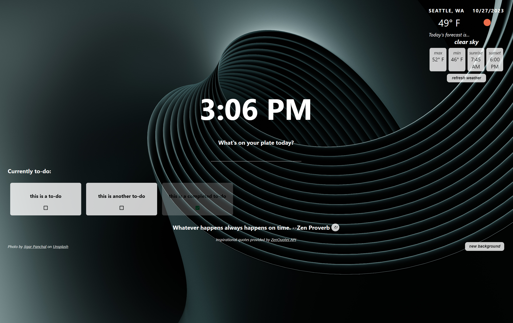

This project was bootstrapped with [Create React App](https://github.com/facebook/create-react-app), using the [Redux](https://redux.js.org/) and [Redux Toolkit](https://redux-toolkit.js.org/) template.

## Project Description

An application to interact with different APIs to display current weather, background iamge, and an inspirational quote. It also provides users with a space to write down their goals for the day. Something like a fancy to-do list with dynamic data.

## To Run This Project

Runs using react-scripts (npm run start). Uses CORS Anywhere demo (https://cors-anywhere.herokuapp.com/corsdemo).

Also requires an API Key for the following services, which can be obtained for free:
* Unsplash (for background images)
* OpenWeatherMap (for real-time weather info)

## Project Development Requirements
✓ Build the application using React and Redux 
✓ Version control your application with Git and host the repository on GitHub 
✓ Write a README (using Markdown) that documents your project 

## Technologies Used
HTML/CSS 
JavaScript, including requests to APIs 
React 
Redux 
Git and GitHub 

## Services Used
Unsplash (background images) 
ZenQuotes (quotes) 
OpenWeatherMap (weather) 

## Project Features
✓ Users can check the current weather 
✓ Users are shown an inspirational image 
✓ Users can cycle through multiple fetched images 
✓ Users are shown an inspirational quote 
✓ Users can write down their goals 
✓ Users can delete goals 
✓ Users can mark goals as complete 

## Future Work
* Automatically detect current location and query for weather
* Initialize with random photo, quote, and image